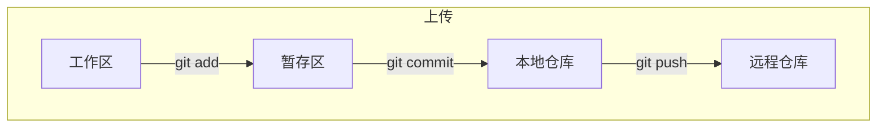

# Git与GitHub

## 分散式仓库结构


仓库的URL为: https://github.com/用户名/项目名

**流程**




## Git设置

1. 设置姓名和邮箱地址

   ```bash
   $ git config --global user.name "yimeisuren"
   $ git config --global user.email "2456387473@qq.com"
   ```

   

   

   这条命令会在`C:\Users\Administrator\.gitconfig`中以如下形式输出设置文件  

   ```.gitconfig
   [user]
   	name = yimeisuren
   	email = 2456387473@qq.com
   ```

   

2. 提高命令输出的可读性

   ```bash
   $ git config --global color.ui auto
   ```

   这条命令也会对配置文件进行如下修改

   ```.gitconfig
   [color]
   	ui = auto
   ```

## GitHub设置

1. 设置 SSH Key (连接仓库需要)

   ```bash
   $ ssh-keygen -t rsa -C "2456387473@qq.com" #设置ssh key命令
   Generating public/private rsa key pair.
   Enter file in which to save the key
   (/Users/your_user_directory/.ssh/id_rsa): #按回车键
   Enter passphrase (empty for no passphrase): #输入密码
   Enter same passphrase again: #再次输入密码
   ```

   输入密码之后出现

   ```bash
   Your identification has been saved in C:\Users\Administrator\.ssh\id_rsa.
   Your public key has been saved in C:\Users\Administrator\.ssh\id_rsa.pub.
   The key fingerprint is:
   fingerprint值 2456387473@qq.com
   The key's randomart image is:
   ```

   其中`id_rsa`是私钥, `id_rsa.pub`是公钥

2.   在GitHub中添加公钥
   
   `id_rsa`和`id_rsa.pub`都可以使用记事本直接打开查看

3. 使用私钥和GitHub进行认证和通信

   ```bash
   $ ssh -T git@github.com
   The authenticity of host 'github.com (207.97.227.239)' can't be established.
   RSA key fingerprint is fingerprint值 .
   Are you sure you want to continue connecting (yes/no)? #输入yes
   Enter passphrase for key '/c/Users/Administrator/.ssh/id_rsa':#输入github账户密码
   ```

   出现如下语句代表操作成功

   ```bash
   $ Hi yimeisuren! You've successfully authenticated, but GitHub does not provide shell access.
   ```

## Git基本操作

### git init—初始化仓库

要使用 Git 进行版本管理, 必须先初始化仓库  

```bash
$ mkdir git-tutorial 	#创建git-tutorial文件夹
$ cd git-tutorial		#进入文件夹
$ git init				#初始化仓库
```


生成的`.git`目录称为<u>附属于该仓库的工作树</u>


### git status—查看仓库的状态

1. 使用`touch`命令创建文件

   ```bash
   touch README.md
   touch sometest.txt
   ```

2. 查看仓库状态

   ```bash
   git status
   ```

   

   + on branch master: 处于master分支
   + commits: 待提交的文件
   + untracked files: git-tutorial目录下*存在*但是*没有被git仓库管理的对象*

### git add—向缓冲区中添加

```bash
git add * #表示添加所有文件
```


### git commit—保存仓库历史记录

```bash
git commit -m "任意一条描述信息"
```

将当前暂存区中的文件实际保存到仓库的历史记录中。通过这些记录, 我们就可以在工作树中复原文件  


### git log—查看提交日志

```bash
git log
```


### git remote add—关联远程仓库

```bash
git remote add <name> <project_url>
```

1. 在GitHub上建立与本地仓库名相同的远程仓库<u>(注意不要勾选自动生成README.md文件)</u>

2. 将本地仓库和远程仓库关联起来

   ```bash
   git remote add origin https://github.com/yimeisuren/git-tutorial #origin为远程仓库名
   ```

### git push—推送至远程仓库

```bash
git push -u origin master
```

### 版本回退

1. 使用`git log`或者`git reflog`命令查看`commitID`属性
2. 使用`git reset --hard <commitID>`来进行版本回退

### 文件忽略

在当前git目录下创建`.gitignore`文件, 在其中配置想要忽略的文件

## 分支

### 创建分支

<u>语法</u>: `git branch <branchName>`


### 查看分支

<u>语法</u>: `git branch`

从下面的示例可以看出, 创建了一个名为`X`的分支, 并显示了出来

```bash
C:\Users\24563\Downloads\Documents\XNote>git branch X
C:\Users\24563\Downloads\Documents\XNote>git branch
  X
* master
```

### 切换分支和当前分支Head

当前分支是指在本地工作区中操作的那个分支. Head指向哪个分支, 则那个分支即为<u>当前分支</u>. 可以使用`git log`查看当前分支, 如下所示当前分支为master分支. 

```bash
C:\Users\24563\Downloads\Documents\XNote>git log
commit 93a491c96359852a42ffff8c7300ac3640416cd7 (HEAD -> master, XNote/master, X)
Author: yimeisuren <2456387473@qq.com>
Date:   Fri Jun 10 10:16:07 2022 +0800

    重新提交
```

使用`git checkout -b <branchName>`进行切换分支, 添加`-b`选项表示如果分支不存在, 则先进行创建分支, 再进行切换, 如下所示

```bash
C:\Users\24563\Downloads\Documents\XNote>git checkout X
Switched to branch 'X'
M       vue-admin-template
M       "\350\275\257\344\273\266\351\241\271\347\233\256\347\256\241\347\220\206/Git\345\222\214GitHub.md"

C:\Users\24563\Downloads\Documents\XNote>git log
commit 93a491c96359852a42ffff8c7300ac3640416cd7 (HEAD -> X, XNote/master, master)
Author: yimeisuren <2456387473@qq.com>
Date:   Fri Jun 10 10:16:07 2022 +0800

    重新提交
```

### 合并分支

<u>语法</u>: `git merge <branchName>`

将`<branchName>`分支中的提交内容合并到当前分支中


# 以前的Git学习记录

本地库和远程库

> A  : 本地库push ------->代码托管中心(远程库),
>
> B : 从代码托管中心clone-------->自己的本地库, 加入A的团队后可以将自己的修改push到A的远程库
>
> A : 从远程库中将B修改的部分pull---------->本地库
>
> C : 没有加入A的团队, 需要将A的远程库fork一份到自己的远程库, 当C做了一些修改希望合并到A的远程库中, 就需要发起pull request, 然后A去审核, 如果可以, A执行merge操作就会把C做的修改合并到自己的项目里面

 

>    ```git
>   3.文件命令
>    git status : 查看工作区,暂存区的状态
>    git add : 添加到暂存区,可撤销
>    git commit -m "your_message": 提交
>    #nothing to commit 没有什么可提交的东西,表示暂存区没有东西
>    #显示no commits yet,代表本地库中没有任何东西,本地库保存的是已经提交的东西 
>
>    #查看历史记录
>    git log --oneline : 一行显示日志
>
>    git reflog : 另外显示HEAD指针需要移动的步数
>    	多屏显示控制 : 空格向下翻页 b向上翻页 q退出
>    	选中即复制,直接粘贴即可
> 
>    #版本前进或后退
>     git reset --hard [局部索引值]
>    	--hard : 	在本地库移动HEAD指针
>   				重置暂存区
>    				重置工作区
>        	--mixed : 	在本地库移动HEAD指针
>    				重置暂存区
>   	--soft  :   只会在本地库移动HEAD指针
> 
>   #被删文件找回 : 	前提是文件曾经被提交到过本地库
>    				删除操作也需要提交到本地库,所有的操作提交到本地库就会生成一个新版本
>    #比较文件差异 :	git diff [文件名]
>    					比较工作区文件和缓存区文件
>    				git diff
>    					比较多个文件
>    				dit diff [本地库历史版本][文件名]
>    					比较当前工作区和历史版本文件
>    			文件以行为单位进行储存,例如在ff后面添加1,会被认为是先删除ff,再写入ff1
>    ```
> 
>    ``` 
>    4.分支操作
>    git branch -v			查看分支,并高亮显示当前所在分支
>    git branch [分支名]  	创建分支
>    git checkout [分支名] 	切换分支
> 
>    #合并分支 : 切换到需要修改的分支上,然后使用git merge [分支名]
>    合并时如果产生分支冲突 : 
>    	1.编辑文件,删除特殊标记
>    	2.修改冲突文件,二选一,再添加
>    	3.git add[文件名]
>    	4.git commit -m"日志信息"
>    ```
> 
> 2. 远程库操作
> 
>    ```
>    git clone [地址] :从远程库克隆到本地库,自动创建别名和初始化本地库
>    github只允许在最新版的基础上进行push,加入我pull的是上一个版本,此时仓库发生了改变,我此时再push就会被拒绝
> 
> 

